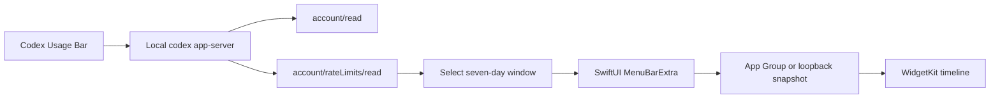

# Codex Usage Bar

> **Stay in flow. Keep your Codex usage in sight.**

[](https://github.com/CMMUU/codex-usage-bar/actions/workflows/ci.yml)
[](https://support.apple.com/macos)
[](https://www.swift.org/)
[](LICENSE)

[Website](https://codex.cmmuu.com/) ·
[Latest release](https://github.com/CMMUU/codex-usage-bar/releases/latest) ·
[中文文档](README.zh-CN.md)

Codex helps developers stay in flow, but checking remaining usage still takes
several clicks: open the profile menu, then navigate to **Remaining usage**.

Codex Usage Bar is a small, native macOS menu bar companion that keeps your
weekly usage, remaining capacity, and reset time one click away—without reading
or storing your authentication token.

<p align="center">
  
</p>

## Features

- Weekly Codex usage and remaining capacity at a glance
- Next quota reset time
- Current plan and limit name
- Automatic refresh every five minutes
- Manual refresh
- Secure in-app updates with a new-version badge
- Launch at login
- Simplified Chinese and English switch shared by the popover and widgets
- Native SwiftUI menu bar interface
- Native WidgetKit widgets for the desktop and Notification Center
- Small and medium widget layouts with stale-data indication
- No browser cookies, copied OAuth tokens, or direct token-file access

## Requirements

- macOS 13 Ventura or later
- A local Codex installation
- Codex signed in with a ChatGPT account that exposes usage limits
- Swift 6.3 toolchain for building from source

API-key-only or local-model sessions may not expose ChatGPT account rate limits.

## Install

Download the latest universal DMG from
[GitHub Releases](https://github.com/CMMUU/codex-usage-bar/releases/latest),
open it, and drag **Codex Usage Bar** to **Applications**.

The current GitHub build uses an ad-hoc signature. If macOS blocks the first
launch, open **System Settings → Privacy & Security** and choose
**Open Anyway**. This confirmation is only required once.

After launching the app once, add **Codex 周限额** from the macOS widget
gallery to the desktop or Notification Center.

Starting with v0.2.1, future releases can be installed from the update button
inside the menu bar popover. Update archives and the appcast are verified with
Sparkle EdDSA signatures.

Each release includes a `.sha256` file:

```bash
shasum -a 256 -c Codex-Usage-Bar-vX.Y.Z-universal.dmg.sha256
```

## Build from source

```bash
git clone https://github.com/CMMUU/codex-usage-bar.git
cd codex-usage-bar
brew install xcodegen
make package
open "dist/Codex Usage Bar.app"
```

The packaged app is written to:

```text
dist/Codex Usage Bar.app
```

Local builds and GitHub Releases use an ad-hoc signature unless
`CODE_SIGN_IDENTITY` and matching Apple credentials are supplied. The release
workflow automatically enables Developer ID signing, Apple notarization, and
stapling when all credentials are configured.

## How it works

Codex Usage Bar starts the local
[`codex app-server`](https://github.com/openai/codex/blob/main/codex-rs/app-server/README.md)
over standard input/output and calls:

- `account/read`
- `account/rateLimits/read`

It identifies the weekly window by `windowDurationMins`, rather than assuming
that a particular response slot always represents the weekly limit.



The app discovers the Codex executable in this order:

1. `CODEX_BINARY_PATH`
2. The Codex binary bundled with the ChatGPT macOS app
3. Homebrew and common user-local binary directories
4. The current `PATH`

## Privacy

Codex Usage Bar:

- does not read `~/.codex/auth.json`
- does not copy or persist access tokens
- does not read browser cookies
- does not send analytics
- does not call undocumented ChatGPT HTTP endpoints directly
- limits the widget fallback bridge to the local loopback interface

It delegates authentication and token refresh to the locally installed Codex
app-server. The app writes only the normalized usage percentage, reset time,
plan label, and update time to its private App Group container. In ad-hoc
builds, the widget reads the same sanitized snapshot over local loopback
without transferring authentication data.

## Development

```bash
# Build
make build

# Run deterministic checks
make test

# Run checks against the currently signed-in local Codex account
make integration-test

# Build the WidgetKit extension with SwiftPM
make widget-build

# Regenerate the checked-in Xcode project
make xcode-project

# Build and ad-hoc sign the universal app bundle
make package

# Build the universal DMG and checksum
make release-package

# Regenerate the README screenshot with deterministic sample data
make docs-screenshot

# Check the repository for local paths and credential patterns
make public-release-check

# Check or deploy the Cloudflare Worker website
make web-check
make web-deploy
```

The verification executable covers:

- primary and secondary rate-limit windows
- `rateLimitsByLimitId` fallback behavior
- weekly-window selection
- invalid percentage clamping
- executable-path overrides
- shared widget snapshot persistence and staleness
- optional live Codex integration

## Project structure

```text
Sources/
├── CodexUsageBar/       # SwiftUI menu bar application
├── CodexUsageCore/      # Codex protocol client and usage selection
├── CodexUsageShared/    # App Group snapshot model and persistence
└── CodexUsageWidget/    # WidgetKit extension
Tests/
└── CodexUsageVerifier/  # Dependency-free verification executable
web/
├── public/              # Cyberpunk-inspired static landing page
├── src/                 # Cloudflare Worker release endpoint
└── test/                # Worker normalization tests
```

## Contributing

Issues and pull requests are welcome. See [CONTRIBUTING.md](CONTRIBUTING.md)
before submitting a change.

For security-sensitive reports, follow [SECURITY.md](SECURITY.md) instead of
opening a public issue.

## Roadmap

- Optional short-window usage display
- Improved multi-account and multi-limit presentation
- User-configurable refresh interval

## Community

- [LINUX DO](https://linux.do/) — a community for technical discussion and open-source sharing.

## License

[MIT](LICENSE)

## Disclaimer

Codex Usage Bar is an independent, unofficial community project. It is not
affiliated with, endorsed by, or sponsored by OpenAI. Codex and OpenAI are
trademarks of their respective owners.
