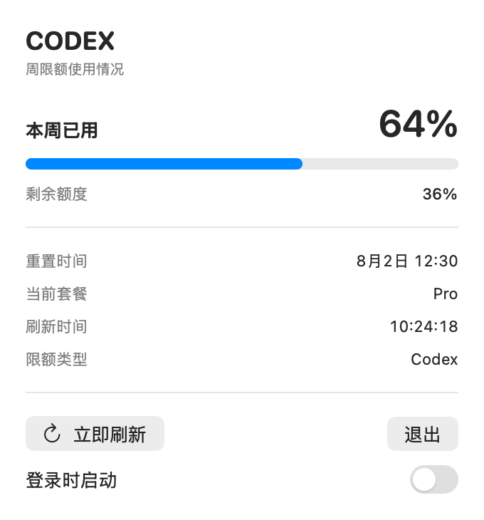
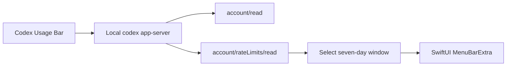

# Codex Usage Bar

> **Stay in flow. Keep your Codex usage in sight.**

[](https://github.com/CMMUU/codex-usage-bar/actions/workflows/ci.yml)
[](https://support.apple.com/macos)
[](https://www.swift.org/)
[](LICENSE)

[Website](https://codex-usage-bar.1690414955.workers.dev/) ·
[Latest release](https://github.com/CMMUU/codex-usage-bar/releases/latest) ·
[中文文档](README.zh-CN.md)

Codex helps developers stay in flow, but checking remaining usage still takes
several clicks: open the profile menu, then navigate to **Remaining usage**.

Codex Usage Bar is a small, native macOS menu bar companion that keeps your
weekly usage, remaining capacity, and reset time one click away—without reading
or storing your authentication token.

<p align="center">
  
</p>

## Features

- Weekly Codex usage and remaining capacity at a glance
- Next quota reset time
- Current plan and limit name
- Automatic refresh every five minutes
- Manual refresh
- Launch at login
- Native SwiftUI menu bar interface
- No browser cookies, copied OAuth tokens, or direct token-file access

## Requirements

- macOS 13 Ventura or later
- A local Codex installation
- Codex signed in with a ChatGPT account that exposes usage limits
- Swift 6.3 toolchain for building from source

API-key-only or local-model sessions may not expose ChatGPT account rate limits.

## Install from source

```bash
git clone https://github.com/CMMUU/codex-usage-bar.git
cd codex-usage-bar
make package
open "dist/Codex Usage Bar.app"
```

The packaged app is written to:

```text
dist/Codex Usage Bar.app
```

The local build uses an ad-hoc signature. A Developer ID-signed and notarized
download will be added in a future release. Until then, building from source is
the recommended installation path.

## How it works

Codex Usage Bar starts the local
[`codex app-server`](https://github.com/openai/codex/blob/main/codex-rs/app-server/README.md)
over standard input/output and calls:

- `account/read`
- `account/rateLimits/read`

It identifies the weekly window by `windowDurationMins`, rather than assuming
that a particular response slot always represents the weekly limit.



The app discovers the Codex executable in this order:

1. `CODEX_BINARY_PATH`
2. The Codex binary bundled with the ChatGPT macOS app
3. Homebrew and common user-local binary directories
4. The current `PATH`

## Privacy

Codex Usage Bar:

- does not read `~/.codex/auth.json`
- does not copy or persist access tokens
- does not read browser cookies
- does not send analytics
- does not call undocumented ChatGPT HTTP endpoints directly

It delegates authentication and token refresh to the locally installed Codex
app-server. Only normalized usage percentages and reset times are held in
memory.

## Development

```bash
# Build
make build

# Run deterministic checks
make test

# Run checks against the currently signed-in local Codex account
make integration-test

# Build and ad-hoc sign the app bundle
make package

# Regenerate the README screenshot with deterministic sample data
make docs-screenshot

# Check the repository for local paths and credential patterns
make public-release-check

# Check or deploy the Cloudflare Worker website
make web-check
make web-deploy
```

The verification executable covers:

- primary and secondary rate-limit windows
- `rateLimitsByLimitId` fallback behavior
- weekly-window selection
- invalid percentage clamping
- executable-path overrides
- optional live Codex integration

## Project structure

```text
Sources/
├── CodexUsageBar/       # SwiftUI menu bar application
└── CodexUsageCore/      # Codex protocol client and usage selection
Tests/
└── CodexUsageVerifier/  # Dependency-free verification executable
web/
├── public/              # Cyberpunk-inspired static landing page
├── src/                 # Cloudflare Worker release endpoint
└── test/                # Worker normalization tests
```

## Contributing

Issues and pull requests are welcome. See [CONTRIBUTING.md](CONTRIBUTING.md)
before submitting a change.

For security-sensitive reports, follow [SECURITY.md](SECURITY.md) instead of
opening a public issue.

## Roadmap

- Developer ID-signed and notarized downloads
- Optional short-window usage display
- Improved multi-account and multi-limit presentation
- User-configurable refresh interval

## License

[MIT](LICENSE)

## Disclaimer

Codex Usage Bar is an independent, unofficial community project. It is not
affiliated with, endorsed by, or sponsored by OpenAI. Codex and OpenAI are
trademarks of their respective owners.
