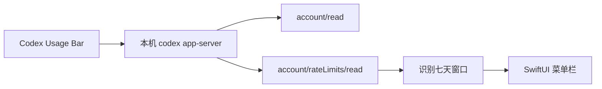

# Codex Usage Bar

> **保持开发心流，随时掌握 Codex 用量。**

[](https://github.com/CMMUU/codex-usage-bar/actions/workflows/ci.yml)
[](https://support.apple.com/macos)
[](https://www.swift.org/)
[](LICENSE)

[English](README.md)

Codex 让开发者保持心流，但查看剩余用量仍然需要中断当前操作：打开左下角账户菜单，再进入
**Remaining usage**。

因此我开发了 Codex Usage Bar——一个轻量、原生、开源的 macOS
菜单栏工具，把周用量、剩余额度和重置时间放到一眼可见的位置，并且不读取或保存认证令牌。

<p align="center">
  
</p>

## 功能

- 菜单栏直接显示 Codex 本周已用比例
- 弹窗显示剩余额度和下次重置时间
- 显示当前套餐和限额名称
- 每五分钟自动刷新
- 支持手动刷新
- 支持登录时启动
- 原生 SwiftUI 菜单栏界面
- 不读取浏览器 Cookie，不复制 OAuth Token，不直接读取认证文件

## 环境要求

- macOS 13 Ventura 或更高版本
- 本机已经安装 Codex
- Codex 已登录能够返回使用限额的 ChatGPT 账号
- 从源码构建需要 Swift 6.3 工具链

仅使用 API Key 或本地模型的会话可能不会返回 ChatGPT 账号限额。

## 从源码安装

```bash
git clone https://github.com/CMMUU/codex-usage-bar.git
cd codex-usage-bar
make package
open "dist/Codex Usage Bar.app"
```

应用产物位于：

```text
dist/Codex Usage Bar.app
```

本地构建使用 ad-hoc 签名。后续版本会增加 Developer ID 签名和 Apple
公证的下载包；在此之前，推荐从源码构建。

## 工作原理

应用通过标准输入输出启动本机
[`codex app-server`](https://github.com/openai/codex/blob/main/codex-rs/app-server/README.md)，
并调用：

- `account/read`
- `account/rateLimits/read`

应用根据 `windowDurationMins` 识别七天周限额窗口，而不是假设某个固定字段始终代表周限额。



Codex 可执行文件按以下顺序查找：

1. `CODEX_BINARY_PATH`
2. ChatGPT macOS 应用内置的 Codex
3. Homebrew 和常见用户级可执行目录
4. 当前 `PATH`

## 隐私

Codex Usage Bar：

- 不读取 `~/.codex/auth.json`
- 不复制或持久化访问令牌
- 不读取浏览器 Cookie
- 不发送分析数据
- 不直接调用未公开的 ChatGPT HTTP 接口

认证和令牌刷新由本机 Codex app-server 负责。应用只在内存中保存标准化后的用量比例和重置时间。

## 开发与验证

```bash
make build
make test
make integration-test
make package
make docs-screenshot
make public-release-check
```

验证器覆盖：

- Primary 和 Secondary 限额窗口
- `rateLimitsByLimitId` 兜底
- 周窗口识别
- 异常百分比边界
- Codex 路径覆盖
- 可选的本机实时集成测试

## 参与贡献

欢迎提交 Issue 和 Pull Request。提交前请阅读
[CONTRIBUTING.md](CONTRIBUTING.md)。

安全问题请按照 [SECURITY.md](SECURITY.md) 私下报告，不要创建公开 Issue。

## 路线图

- Developer ID 签名和 Apple 公证下载
- 可选的短周期用量显示
- 改进多账号和多限额展示
- 自定义刷新间隔

## 许可证

[MIT](LICENSE)

## 免责声明

Codex Usage Bar 是独立的非官方社区项目，与 OpenAI
不存在隶属、认可或赞助关系。Codex 和 OpenAI 商标归其各自权利人所有。
